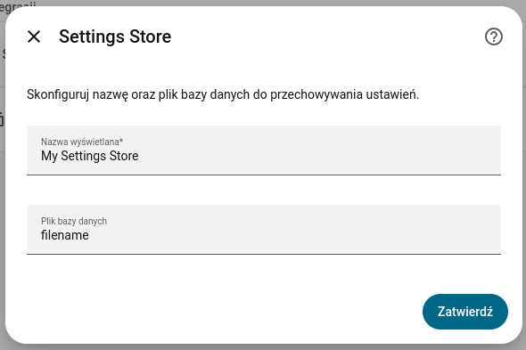
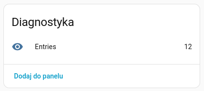

# Settings Store

This Home Assistant integration provides persistent, key-value storage backed by SQLite for automations, scripts, and
integrations.

It allows you to store, update, retrieve, and delete arbitrary settings organized by **scopes** (namespaces) and
**keys**, persisting them safely across Home Assistant restarts.

It is especially useful when you want to:

- Avoid cluttering Home Assistant with dummy helper entities (`input_text`, `input_number`, `input_boolean`, template
  sensors, or switches) created solely to persist intermediate states or automation variables.
- Store state, runtime configuration, or counters that need to persist across restarts.
- Organize settings into logical namespaces (`scope`) and key names (`name`).
- Share custom configuration data between different automations, scripts, and templates.
- Dynamically update and query parameters at runtime without modifying YAML configuration files.

## Installation

This integration is installed via **HACS**:

1. In Home Assistant, go to **HACS → Integrations → Custom Repositories**.
2. Enter the repository URL: `https://github.com/catgiggle/HomeAssistant-SettingsStore`.
3. Set the type to **Integration** and click **Add**.
4. Install the integration through HACS.
5. Restart Home Assistant.
6. The integration will appear under **Configuration → Integrations**.

## Configuration

You can add **multiple instances** of this integration. Each instance represents an isolated SQLite settings store.



| Parameter       | Description                                                                                                               |
|-----------------|---------------------------------------------------------------------------------------------------------------------------|
| `Display name`  | Display name for the instance (shown in Home Assistant UI).                                                               |
| `Internal name` | Unique identifier used as the SQLite database filename. If left empty, it is generated automatically from `Display name`. |

## Features

- Persistent key-value storage backed by SQLite (`.storage/settings_store/<name>.db`)
- Grouping of settings using scopes (namespaces) and keys
- No need to create throwaway helper entities (`input_*`, dummy switches/sensors) just to store state
- Atomic upsert operations (insert or update on key conflict)
- Diagnostic sensor reporting total stored entries count
- Response data support in the `get` service for use in templates, scripts, and automations
- Ability to delete individual entries or clear the entire store
- Isolated storage per configured instance



## Entities

Each configured instance creates the following diagnostic sensor:

- `Entries`: Displays the current total number of entries stored
  in the instance's database. This sensor automatically updates whenever records are created, updated, deleted or
  cleared. Its `entity_id` is passed as a target parameter to the integration's services.

## Services

This integration provides the following services:

### `settings_store.set`

Sets or updates a value for a specific scope and name in the store. If the entry already exists, its value is updated.

| Field       | Description                                                                 |
|-------------|-----------------------------------------------------------------------------|
| `entity_id` | Entity ID of the Settings Store sensor (identifies target storage instance) |
| `scope`     | Scope / namespace for grouping settings                                     |
| `name`      | Setting key name                                                            |
| `value`     | Value to store                                                              |

### `settings_store.get`

Retrieves the stored value for a given scope and name. Supports returning service response data.

| Field       | Description                                                                 |
|-------------|-----------------------------------------------------------------------------|
| `entity_id` | Entity ID of the Settings Store sensor (identifies target storage instance) |
| `scope`     | Scope / namespace identifier                                                |
| `name`      | Setting key name                                                            |

#### Response

Returns the stored value string or `null` if the key does not exist.

### `settings_store.delete`

Deletes a specific setting identified by scope and name.

| Field       | Description                                                                 |
|-------------|-----------------------------------------------------------------------------|
| `entity_id` | Entity ID of the Settings Store sensor (identifies target storage instance) |
| `scope`     | Scope / namespace identifier                                                |
| `name`      | Setting key name                                                            |

### `settings_store.clear`

Removes all stored entries from the instance's database.

| Field       | Description                                                                 |
|-------------|-----------------------------------------------------------------------------|
| `entity_id` | Entity ID of the Settings Store sensor (identifies target storage instance) |

## Usage Examples

### Storing a Value

```yaml
action: settings_store.set
data:
  entity_id: sensor.settings_store_main_entries
  scope: irrigation
  name: last_run_duration
  value: "15"
```

### Retrieving a Value in an Automation or Script

```yaml
action: settings_store.get
data:
  entity_id: sensor.settings_store_main_entries
  scope: irrigation
  name: last_run_duration
response_variable: saved_setting

action: notify.persistent_notification
data:
  message: "Last duration was {{ saved_setting.value }} minutes."
```

### Deleting a Setting

```yaml
action: settings_store.delete
data:
  entity_id: sensor.settings_store_main_entries
  scope: irrigation
  name: last_run_duration
```

### Clearing All Settings

```yaml
action: settings_store.clear
data:
  entity_id: sensor.settings_store_main_entries
```

## Notes

- Settings are stored in `.storage/settings_store/<name>.db` within your Home Assistant configuration directory.
- Values are stored as strings in SQLite, allowing you to store primitive values, JSON strings, or serialized payloads.
- Removing an instance through the Home Assistant UI will automatically delete its associated database file.
